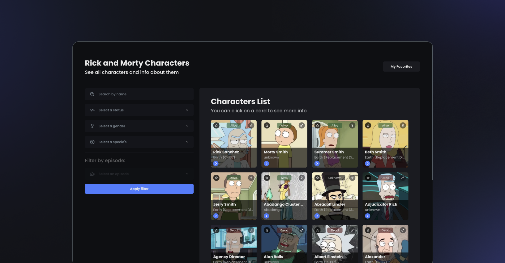

# Rick and Morty Catalog

A catalog of characters from the Rick and Morty series. This project was created using Next.js and integrates with the [Rick and Morty API](https://rickandmortyapi.com/documentation/). It includes a list of characters with search and pagination features, and a detail page with the option to favorite a character.

## Features

- Pagination
- Filters by name, status, gender, and species
- Favorite characters in list and detail pages
- Responsive layout
- Optimized images
- Incremental Static Generation
- Cache for API requests
- Minimal and performant render

## Tech Stack

- Next.js
- TypeScript
- Styled Components (Atomic Design)
- MobX / Mobx-Persist-Store
- Axios
- Zod
- React Hook Form

## Persisting Store and Hydration

To persist the store across sessions, the [mobx-persist-store](https://github.com/alvfork/mobx-persist-store) library was used in combination with [localForage](https://localforage.github.io/localForage/) to save data in the browser's IndexedDB storage. This enabled easy integration with MobX, allowing the store to be cached and retrieved even after the browser is closed. Additionally, a custom hook called `useClientSideStore` was created to solve hydration problems, ensuring that the store was properly initialized on the client-side and avoiding inconsistencies between server and client data.

## Deploy

You can see this project in action, [click here](https://rick-and-morty-pedrogpo.vercel.app/)

## Getting Started

1. Clone the repository: `git clone https://github.com/pedrogpo/rick-and-morty.git`
2. Navigate to the project directory: `cd rick-and-morty`
3. Install dependencies: `yarn install`
4. Run the development server: `yarn dev`
5. Open [http://localhost:3000](http://localhost:3000) in your browser

## Tests

This project includes unit tests using Jest and React Testing Library. To run the tests, use the command `yarn test`.

## Priorities

This project was built with a focus on performance and optimization, avoiding unnecessary renders and requests. Incremental Static Generation was used to generate pages statically at build time and at runtime, reducing the response time for users. The images were also optimized to ensure faster loading times.

## License

This project is licensed under the [MIT License](https://choosealicense.com/licenses/mit/).
